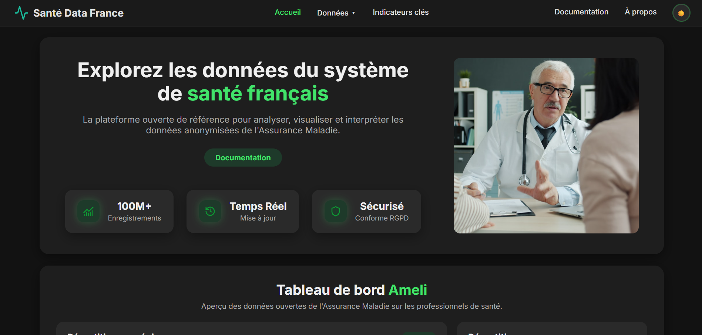
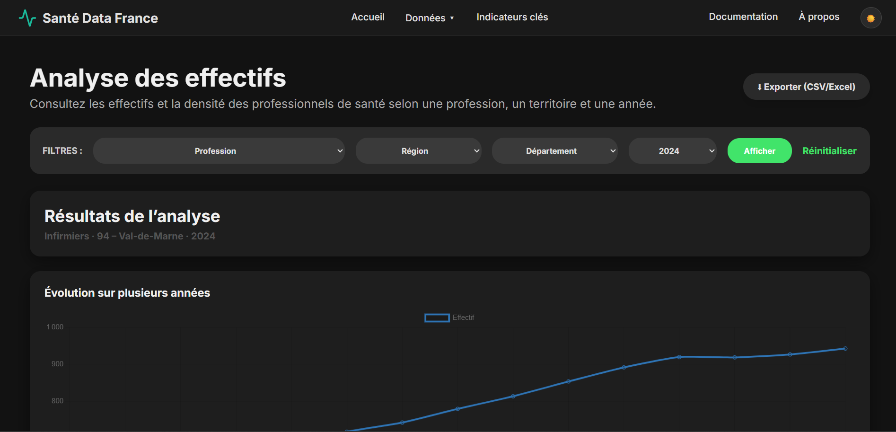
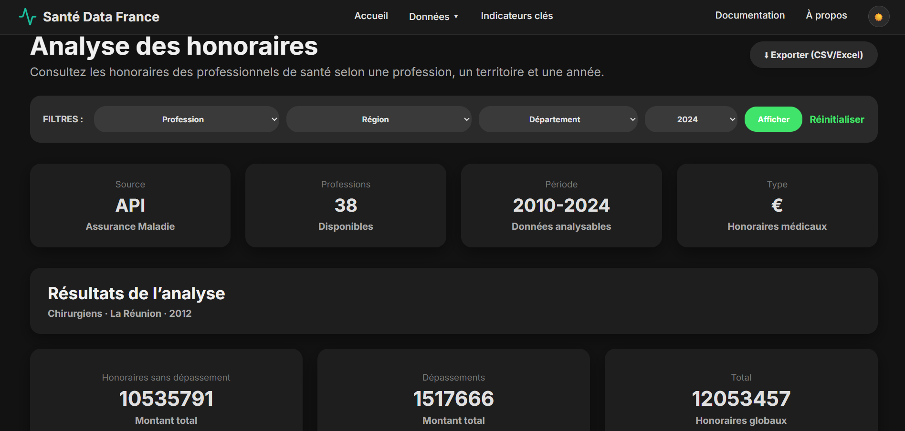
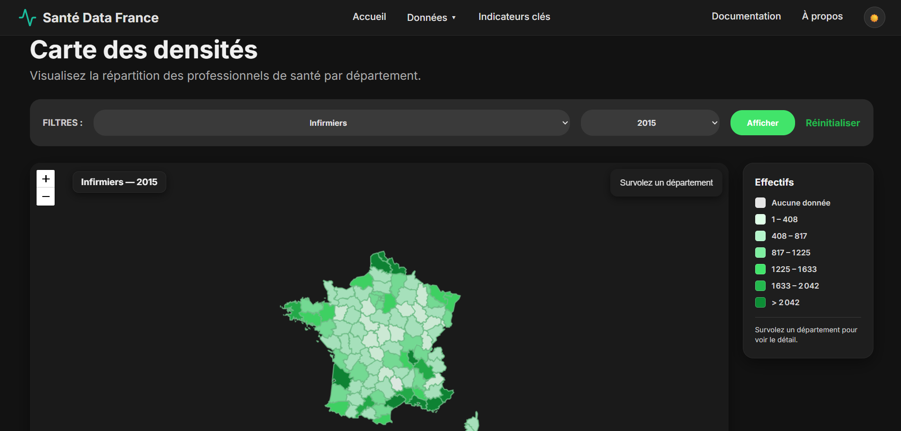
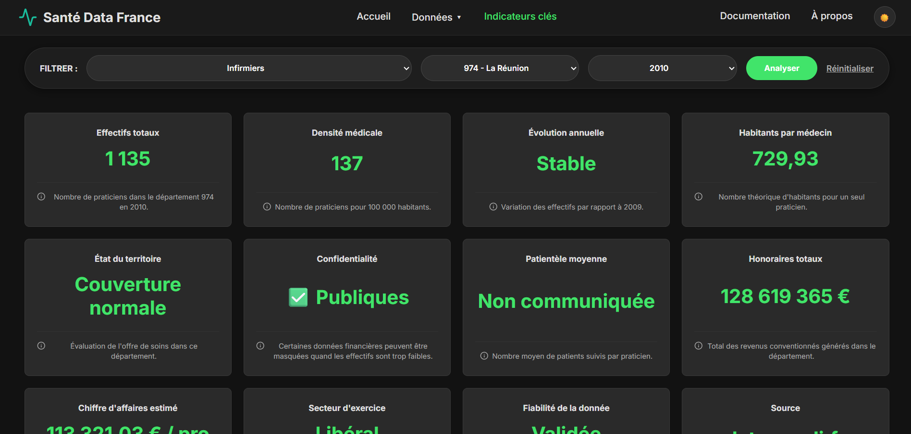
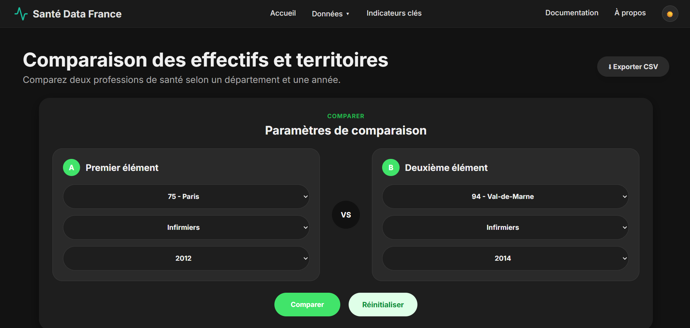
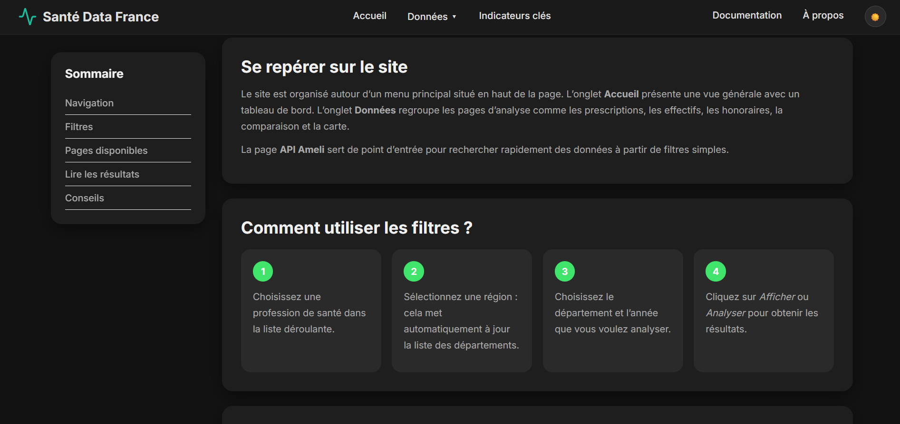
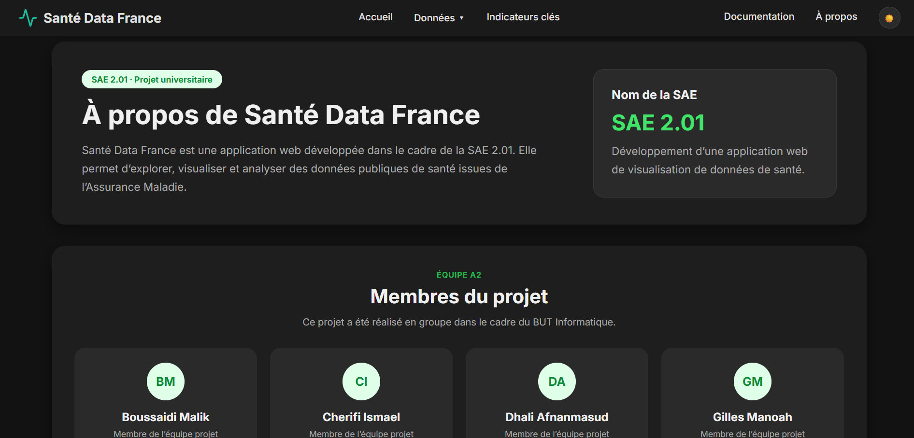

# Santé Data France

>>>LIEN GITHUB --> https://github.com/Manoah007/SAE201-app

## Présentation du projet

**Santé Data France** est une application web développée dans le cadre des SAÉ 2.01, 2.04 et 2.05 du BUT Informatique.

Le projet a pour objectif d’exploiter des données publiques de santé issues de l’Assurance Maladie afin de les rendre plus simples à consulter, à analyser et à comparer. L’application s’appuie sur une base de données locale composée de 9 tables de dimensions, construite lors de la SAÉ 2.04, et sur l’API publique `data.ameli.fr` pour récupérer les données dynamiques en temps réel.

L’application permet notamment de visualiser les effectifs de professionnels de santé, les densités médicales, les honoraires, les prescriptions, ainsi que plusieurs indicateurs utiles pour comparer les territoires.

L’objectif principal est donc de transformer des données brutes parfois difficiles à lire en informations claires, visuelles et exploitables pour l’utilisateur.

---

## Composition de l’équipe

Le projet a été réalisé par l’équipe A2, composée de quatre membres :

* **Malik BOUSSAIDI** — Scrum Master
* **Ismaël CHERIFI** — Développeur Back-end
* **Afnanmasud DHALI** — Développeur Front-end
* **Manoah GILLES** — Tech Lead

Chaque membre a participé au développement du projet, avec une répartition des tâches par fonctionnalité : effectifs, honoraires, prescriptions, carte, indicateurs, comparaison, interface et architecture générale.

---

## Technologies utilisées

Le projet utilise les technologies suivantes :

* **Python 3**
* **Flask**
* **Jinja2**
* **SQLAlchemy**
* **MySQL**
* **PyMySQL**
* **HTML / CSS**
* **JavaScript**
* **Chart.js**
* **Leaflet**
* **Requests**
* **Pytest**
* **Git / GitHub**

---

## Architecture du projet

L’application suit une organisation proche du modèle MVC afin de bien séparer les responsabilités du code.

```text
SAE201-app/
├── app.py                         # Point d’entrée de l’application Flask
├── config.py                      # Configuration générale du projet
├── .env                           # Variables sensibles, non versionnées
├── .env.example                   # Exemple de configuration
├── .gitignore                     # Fichiers à exclure de Git
├── pytest.ini                     # Configuration des tests Pytest
├── README.md                      # Documentation du projet
│
├── controllers/                   # Routes Flask
│   ├── accueil.py
│   ├── api.py
│   ├── apropos.py
│   ├── carte.py
│   ├── comparaison.py
│   ├── documentation.py
│   ├── effectifs.py
│   ├── honoraires.py
│   ├── indicateurs.py
│   └── prescriptions.py
│
├── models/                        # Modèles ORM SQLAlchemy
│   ├── db.py
│   └── dimensions.py
│
├── services/                      # Logique métier et appels API
│   ├── ameli_api.py
│   ├── dashboard_service.py
│   └── prescription_service.py
│
├── templates/                     # Pages HTML Jinja2
│   ├── base.html
│   ├── accueil.html
│   ├── apropos.html
│   ├── carte.html
│   ├── comparaison.html
│   ├── documentation.html
│   ├── effectifs.html
│   ├── erreur.html
│   ├── faq.html
│   ├── honoraires.html
│   ├── indicateurs.html
│   └── page_disparite.html
│
├── static/                        # Fichiers statiques
│   ├── css/
│   ├── js/
│   └── images/
│
└── test_prescription.py           # Tests unitaires liés aux prescriptions
```

---

## Rôle des principaux dossiers

### `controllers/`

Ce dossier contient les routes Flask. Chaque fichier correspond à une partie du site : accueil, effectifs, honoraires, prescriptions, carte, comparaison, indicateurs, documentation ou page à propos.

Les contrôleurs récupèrent les paramètres envoyés par l’utilisateur, appellent les services nécessaires, puis renvoient les pages HTML avec les données à afficher.

### `models/`

Ce dossier contient les modèles SQLAlchemy utilisés pour représenter les tables de dimensions de la base de données.

Les principales dimensions sont :

* Régions
* Départements
* Professions de santé
* Tranches d’âge
* Sexe
* Types d’exercice
* Types de secteur
* Types d’honoraires
* Types de prescriptions

### `services/`

Ce dossier regroupe la logique métier. On y retrouve notamment les appels à l’API Ameli, la préparation des données pour les graphiques, la gestion de la pagination et certaines transformations nécessaires avant l’affichage.

### `templates/`

Ce dossier contient les pages HTML utilisant Jinja2. Le fichier `base.html` sert de structure commune pour toutes les pages du site : header, menu de navigation, footer et chargement des fichiers CSS/JS.

### `static/`

Ce dossier contient les fichiers CSS, JavaScript et les images utilisées dans l’application. Il permet de gérer l’apparence du site, les graphiques, les filtres dynamiques, le thème sombre et certaines interactions utilisateur.

---

## Gestion des fichiers de configuration

### `.env`

Le fichier `.env` contient les informations sensibles nécessaires à la connexion à la base de données, comme l’utilisateur, le mot de passe, l’hôte et le nom de la base.

Ce fichier ne doit jamais être envoyé sur GitHub.

Exemple de contenu :

```env
DB_USER=...
DB_PASSWORD=...
DB_HOST=...
DB_NAME=...
SECRET_KEY=...
```

### `.env.example`

Le fichier `.env.example` sert de modèle pour les membres du groupe. Il montre les variables attendues, sans exposer les vraies informations sensibles.

Exemple :

```env
DB_USER=sae204_XX_user
DB_PASSWORD=*********
DB_HOST=mysql-sae204.alwaysdata.net
DB_NAME=sae204_XX_bd
FLASK_ENV=development
SECRET_KEY=cle_secrete
```

### `.gitignore`

Le fichier `.gitignore` permet d’éviter de versionner les fichiers inutiles ou sensibles.

Il exclut notamment :

```text
.env
__pycache__/
*.pyc
venv/
.vscode/
```

Cela permet de garder le dépôt Git propre et sécurisé.

---

## Prérequis

Avant de lancer le projet, il faut avoir :

* Python 3 installé
* Git installé
* Un accès à la base de données MySQL du projet
* Une connexion Internet pour accéder à l’API Ameli
* Un éditeur de code comme VS Code

Il faut aussi installer les dépendances Python utilisées par le projet.

---

## Installation du projet

### 1. Cloner le dépôt

```bash
git clone <lien-du-repository>
cd SAE201-app
```

### 2. Créer un environnement virtuel

Sur Windows :

```bash
python -m venv venv
venv\Scripts\activate
```

Sur macOS / Linux :

```bash
python3 -m venv venv
source venv/bin/activate
```

### 3. Installer les dépendances

```bash
pip install flask sqlalchemy pymysql python-dotenv requests pytest
```

Si un fichier `requirements.txt` est ajouté au projet, il est aussi possible d’utiliser :

```bash
pip install -r requirements.txt
```

### 4. Configurer le fichier `.env`

Créer un fichier `.env` à partir du fichier `.env.example`.

```bash
cp .env.example .env
```

Sur Windows, si la commande ne fonctionne pas :

```bash
copy .env.example .env
```

Ensuite, compléter le fichier `.env` avec les vraies informations de connexion à la base de données.

---

## Commande de lancement

Pour lancer l’application en local :

```bash
python app.py
```

Une fois le serveur lancé, ouvrir le navigateur à l’adresse suivante :

```text
http://127.0.0.1:5000
```

L’application démarre en mode debug, ce qui permet de voir les erreurs plus facilement pendant le développement.

---

## Lancer les tests

Le projet contient des tests unitaires avec Pytest, notamment pour vérifier une partie de la logique liée aux prescriptions.

Commande :

```bash
pytest
```

Ou bien :

```bash
python -m pytest
```

Ces tests permettent de vérifier certaines fonctions sans dépendre directement de l’API externe, grâce à l’utilisation de mocks.

---

## Captures d’écran des pages principales

Les captures d’écran sont placées dans un dossier `docs/screen_readme/`.

### Page d’accueil



La page d’accueil présente le projet, les accès principaux et un tableau de bord avec des graphiques issus des données Ameli.

### Page Effectifs



Cette page permet de consulter les effectifs et la densité des professionnels de santé selon une profession, un département et une année.

### Page Honoraires



Cette page affiche les données liées aux honoraires, aux dépassements et aux montants totaux selon les filtres sélectionnés.

### Page Carte des densités



La carte interactive permet de visualiser la répartition des professionnels de santé par département.

### Page Indicateurs clés



Cette page affiche plusieurs indicateurs utiles comme les effectifs, la densité médicale, l’évolution annuelle ou encore l’état du territoire.

### Page Comparaison



Cette page permet de comparer deux professions, deux départements ou deux années afin de visualiser les écarts.

### Page Documentation



La page documentation explique le fonctionnement général du site, l’utilisation des filtres et la lecture des résultats.

### Page À propos



Cette page présente le projet, l’équipe, les objectifs, les technologies utilisées et l’architecture générale de l’application.

---

## Fonctionnalités implémentées

### Fonctionnalités minimales

* Création d’une application web avec Flask
* Mise en place d’une architecture claire avec controllers, models, services, templates et static
* Connexion à une base de données MySQL
* Utilisation de SQLAlchemy pour accéder aux tables de dimensions
* Chargement des régions, départements et professions depuis la base locale
* Utilisation de l’API publique de l’Assurance Maladie
* Affichage des effectifs de professionnels de santé
* Affichage des honoraires
* Affichage des prescriptions
* Présentation des résultats sous forme de tableaux
* Navigation globale entre les pages principales
* Page FAQ
* Page Documentation
* Page À propos

### Fonctionnalités avancées

* Graphiques interactifs avec Chart.js
* Carte interactive avec Leaflet
* Comparaison entre deux sélections
* Tableau de bord sur la page d’accueil
* Page d’indicateurs clés avec plusieurs KPI
* Filtres dynamiques par région, département, profession et année
* Filtres en cascade pour mettre à jour les départements selon la région choisie
* Gestion des données indisponibles
* Détection des cas où l’API ne renvoie aucun résultat
* Export CSV des tableaux
* Thème clair et thème sombre
* Utilisation d’un fichier `.env` pour sécuriser les informations sensibles
* Utilisation d’un `.gitignore` propre
* Organisation du travail avec Git
* Tests unitaires avec Pytest
* Mise en cache de certaines données pour améliorer les performances
* Gestion de la pagination sur les appels API volumineux
* Filtrage des données pour éviter les doublons régionaux ou nationaux dans certaines requêtes

---

## Pages disponibles dans l’application

| Page               | Description                                               |
| ------------------ | --------------------------------------------------------- |
| Accueil            | Présentation générale et tableau de bord                  |
| Effectifs          | Analyse des effectifs et densités médicales               |
| Honoraires         | Analyse des honoraires et dépassements                    |
| Prescriptions      | Analyse des dépenses de prescriptions par zone            |
| Carte des densités | Visualisation géographique par département                |
| Indicateurs clés   | Affichage de KPI sur les données de santé                 |
| Comparaison        | Comparaison entre deux professions, territoires ou années |
| Documentation      | Guide d’utilisation du site                               |
| FAQ                | Réponses aux questions fréquentes                         |
| À propos           | Présentation du projet et de l’équipe                     |

---

## Difficultés rencontrées

Pendant le projet, plusieurs difficultés ont été rencontrées.

La première difficulté concernait l’API Ameli. Certaines requêtes renvoyaient beaucoup de données ou des résultats mélangés entre niveau national, régional et départemental. Pour éviter les erreurs dans les totaux, il a fallu filtrer les données et conserver uniquement les codes de départements présents dans notre base locale.

Une autre difficulté concernait le travail en groupe avec Git. Plusieurs membres travaillaient parfois sur les mêmes fichiers, comme `app.py`, `style.css` ou certains templates. Cela a parfois créé des conflits de merge, qu’il a fallu corriger manuellement.

Enfin, certaines données de l’API peuvent être absentes ou masquées, notamment quand les effectifs sont trop faibles. Dans ce cas, l’application doit afficher un message clair plutôt que de planter.

---

## Sécurité et bonnes pratiques

Plusieurs bonnes pratiques ont été appliquées dans le projet :

* Le fichier `.env` n’est pas versionné
* Un fichier `.env.example` est fourni pour faciliter l’installation
* Les fichiers inutiles comme `__pycache__`, `*.pyc` ou `venv/` sont exclus de Git
* Les appels API sont regroupés dans des services
* Les routes Flask sont séparées dans des blueprints
* Les templates utilisent une base commune avec `base.html`
* Les erreurs sont gérées avec des pages dédiées
* Les tests permettent de vérifier une partie du comportement attendu

---

## Limites du projet

Le projet reste une application universitaire et certaines limites existent encore.

Par exemple, l’application dépend de la disponibilité de l’API Ameli. Si l’API est lente ou temporairement indisponible, certaines pages peuvent ne pas afficher de données.

Certaines fonctionnalités comme la création de comptes utilisateurs, la modification des données ou l’administration avancée n’ont pas été développées, car elles étaient hors périmètre du projet.

---

## Conclusion

Santé Data France est une application web complète qui permet d’explorer et de visualiser des données publiques de santé de manière plus claire.

Le projet nous a permis de travailler sur plusieurs compétences importantes : la création d’une application Flask, l’utilisation d’une base de données MySQL, l’exploitation d’une API externe, la création d’interfaces utilisateurs, la gestion d’un projet en groupe avec Git, ainsi que la mise en place de tests et de bonnes pratiques de développement.

Cette application répond donc aux objectifs demandés tout en proposant plusieurs fonctionnalités avancées comme les graphiques, la carte interactive, les indicateurs clés, la comparaison et le thème sombre.
